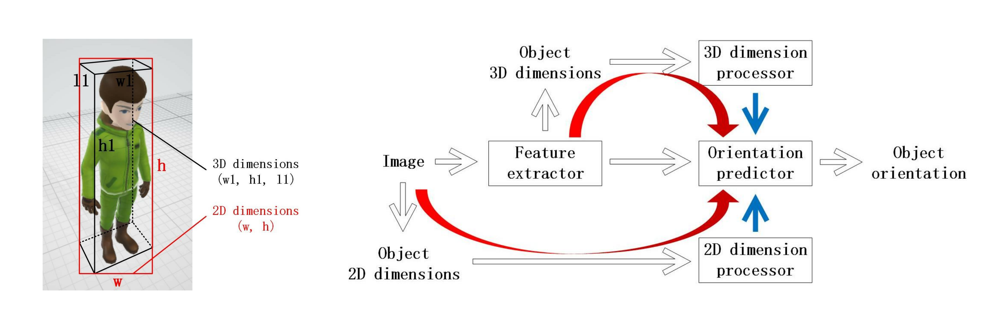

# FFNet

<div align="center">
    
</div>

## Overview

The PyTorch implementation of our paper:
> **Chenchen Zhao**, Yeqiang Qian, and Ming Yang. Monocular Pedestrian Orientation Estimation Based on Deep 2D-3D Feedforward. Pattern Recognition 2020 <br>
> [[paper](https://arxiv.org/pdf/1909.10970)] [[learn more]()]

We propose a test-time monocular 2D pedestrian orientation estimation model. The model receives the image features and the 2D & 3D (train-time) dimension information as inputs, and outputs the estimated orientation of each pedestrian object. The model is ranked 9/162 on [the KITTI Pedestrian Orientation Estimation Evaluation Benchmark](https://www.cvlibs.net/datasets/kitti/eval_object.php?obj_benchmark=2d)

Code inspired by [Deep3DBox](https://github.com/smallcorgi/3D-Deepbox)

*3.5 years later...*
- Rewrite the code
- Add high-freq embedding strategies to the input 2D & 3D dimensions. The strategies are similar to the timestep embedding strategy in diffusion models

## Usage

Run `python main.py train` to train a model

Run `python main.py val` to validate the performance of the model on the validation split

Run `python main.py test` to test the performance on the test set, and record the results in the format for the benchmark. Valid 2D pedestrian object detection results are required

> The authors appreciate the authors of [LED](https://ieeexplore.ieee.org/abstract/document/8451206?casa_token=wadAQIP5c7IAAAAA:avHNeedOveC4gDyQ0YchUi4TmSOqPyIPwSf6BJ73eY-BniHt0VQ6FiCBhEyrDqiHL3R3Zb-s6A) who provide the 2D results, and use the exact results for the benchmark

## Performance

| Model | Moderate % | Easy % | Hard % | Runtime /s | Ranking |
| --- | --- | --- | --- | --- | --- |
| **FFNet (ours)** | 59.17 | 69.17 | 54.95 | 0.22 | 2nd |
| [SubCNN](https://github.com/tanshen/SubCNN) <sup>[1](#subcnn)</sup> | 66.28 | 78.33 | 61.37 | 2.00 | 1st |
| Mono3D <sup>[2](#mono3d)</sup> | 58.12 | 68.58 | 54.94 | 4.20 | 3rd |
| [MonoPSR](https://github.com/kujason/monopsr) <sup>[3](#monopsr)</sup> | 56.30 | 70.56 | 49.84 | 0.20 | 4th |
| Shift R-CNN <sup>[4](#shiftrcnn)</sup> | 48.81 | 65.39 | 41.05 | 0.25 | 5th |
| FFNet backbone | 38.92 | 46.36 | 35.63 | 0.21 | 6th |

## BibTeX
```bibtex
@article{zhao2020monocular,
  title={Monocular pedestrian orientation estimation based on deep 2{D}-3{D} feedforward},
  author={Zhao, Chenchen and Qian, Yeqiang and Yang, Ming},
  journal={Pattern Recognition},
  volume={100},
  pages={107182},
  year={2020},
  publisher={Elsevier}
}
```

## References
<div id="subcnn"></div>
[1] Yu Xiang, Wongun Choi, Yuanqing Lin, and Silvio Savarese. Subcategory-aware convolutional neural networks for object proposals and detection. In 2017 IEEE Winter Conference on Applications of Computer Vision, pages 924–933, 2017.
<div id="mono3d"></div>
[2] Xiaozhi Chen, Kaustav Kundu, Ziyu Zhang, Huimin Ma, Sanja Fidler, and Raquel Urtasun. Monocular 3D object detection for autonomous driving. In Proceedings of the IEEE Conference on Computer Vision and Pattern Recognition, pages 2147–2156, 2016.
<div id="monopsr"></div>
[3] Jason Ku, Alex D Pon, and Steven L Waslander. Monocular 3D object detection leveraging accurate proposals and shape reconstruction. In Proceedings of the IEEE Conference on Computer Vision and Pattern Recognition, pages 11867–11876, 2019.
<div id="shiftrcnn"></div>
[4]  Andretti Naiden, Vlad Paunescu, Gyeongmo Kim, ByeongMoon Jeon, and Marius Leordeanu. Shift R-CNN: Deep monocular 3D object detection with closed-form geometric constraints. arXiv preprint arXiv:1905.09970, 2019.
